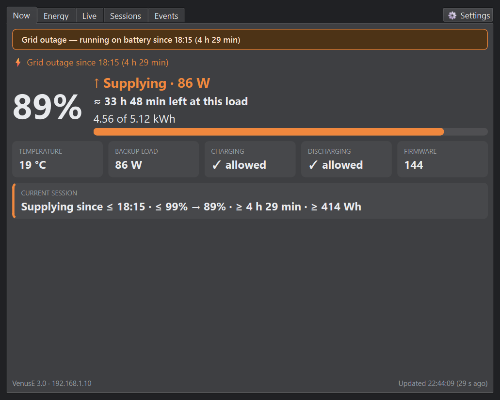
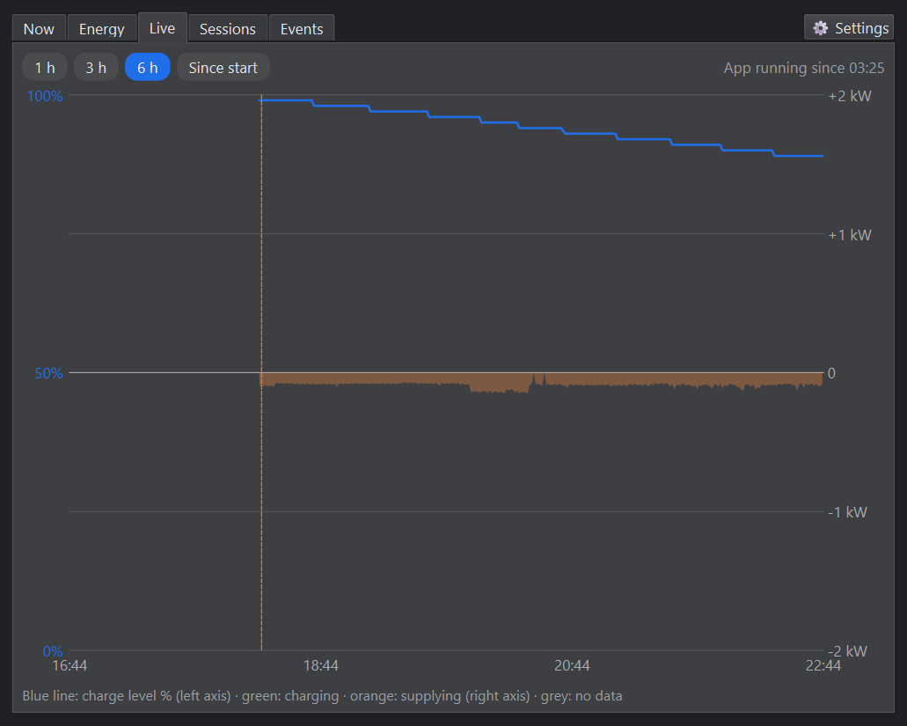
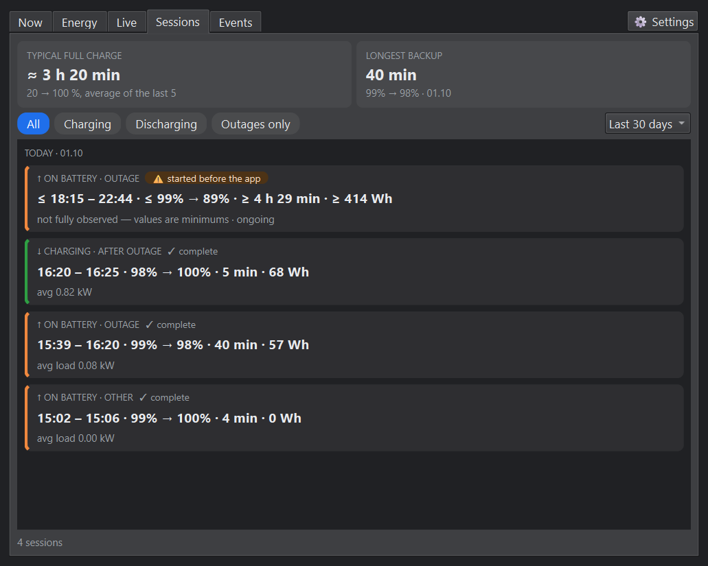
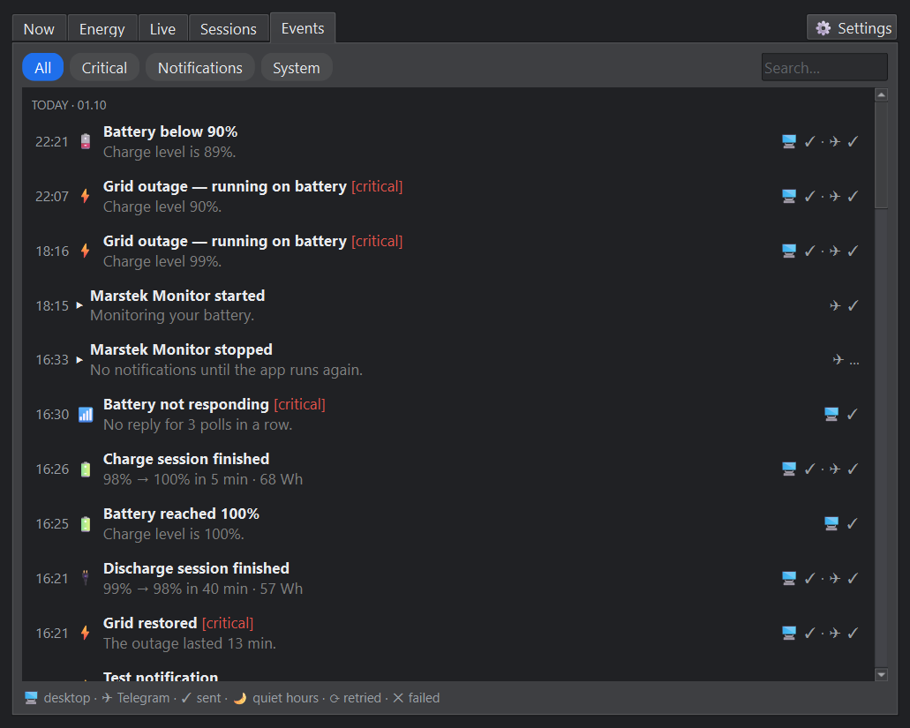
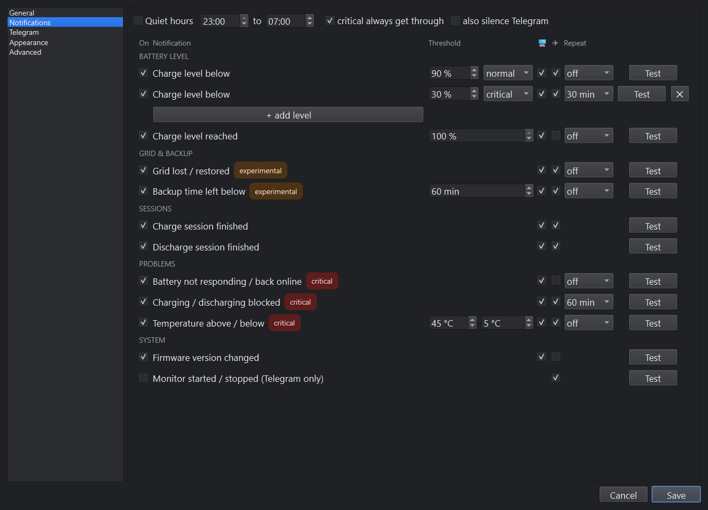

# Marstek Monitor

A small Windows tray app that watches a **Marstek Venus E 3.0** home battery over your home
network. If you use the battery as a UPS, it tells you at a glance how full the battery is,
whether the grid is down, and how long the backup will last. It also sends desktop and Telegram
notifications, for example when the power goes out or the charge drops below a level you choose.

**It only reads from the battery and never changes any battery setting.** It uses the battery's
Local API (JSON over UDP on your network) and only ever sends these read commands:
`Marstek.GetDevice`, `Wifi.GetStatus`, `Bat.GetStatus`, `ES.GetStatus`, `EM.GetStatus`.



| Tray icon | | | | | |
|:-:|:-:|:-:|:-:|:-:|:-:|
|  |  |  |  |  |  |
| normal | charging | grid outage | low | not responding | error |

## Features

- Charge level, power, stored energy, temperature and backup load, updated every minute.
- **Grid outage detection** (experimental) with the **time left** on the battery, based on the
  real drain once it has been measured.
- **Sessions**: every charge and discharge, with duration, energy and cause (for example an outage).
- **Live chart**, lifetime **energy** totals, and a log of all events.
- **Notifications** on the desktop and in **Telegram**, each with its own threshold, repeat
  interval and priority, quiet hours, and a `/marstek` command that replies with the current status.
- English and Ukrainian, light and dark theme, adjustable font size.

| Live | Sessions |
|---|---|
|  |  |
| **Events** | **Notification settings** |
|  |  |

## Quick start

1. Turn on the battery's **Local API** in the Marstek app (default UDP port 30000).
2. Download `MarstekMonitor-<version>-win64.zip` from
   [Releases](https://github.com/yep-it/windows-marstek-venus-e-monitor/releases), unzip it and run
   `MarstekMonitor.exe`. If SmartScreen warns, click **More info → Run anyway**.
3. Allow the app on **private networks** when Windows Firewall asks.
4. The battery icon appears in the tray; the app finds the battery on the network by itself.
   Click the icon to open the monitor, right-click it for Settings.
5. Optional: turn on **Settings → Advanced → Outage detection** and set up Telegram.

## Documentation

- **[User guide (English)](docs/user-guide.md)**: every tab, setting and notification, Telegram
  setup, outages and backup time, troubleshooting.
- **[Посібник користувача (українською)](docs/user-guide.uk.md)**

## Development

### Requirements

- Windows 11, Python 3.13 (for running from source)
- Local API enabled in the Marstek app (default UDP port 30000), with the PC on the same network

### Run from source

```bash
python -m venv .venv
.venv/Scripts/python -m pip install -e ".[dev]"
.venv/Scripts/python -m marstek_monitor
```

On the first run Windows may ask whether the app may receive UDP on private networks. Allow it,
otherwise the battery's replies are blocked.

### Build the exe

```powershell
powershell -ExecutionPolicy Bypass -File packaging\build.ps1
```

The result is `dist\MarstekMonitor\MarstekMonitor.exe` (one folder, about 100 MB). Copy the whole folder.

### Releasing a new version

1. Change `__version__` in `marstek_monitor/__init__.py`. This is the only place the version is
   written; the exe's file properties and the package take it from there.
2. Optionally describe the changes in `docs/releases/v<version>.md`.
3. Commit, then tag and push:
   ```bash
   git tag v0.2.0
   git push origin main v0.2.0
   ```
   GitHub Actions (`.github/workflows/release.yml`) runs the tests, builds the exe and publishes
   the release with the zip. The tag has to match `__version__`, otherwise nothing is published.

### Data files

`%APPDATA%\MarstekMonitor\`: `settings.json`, `history.db`, and `logs\app.log`. With
*Advanced → Record raw data* switched on, every raw response is also saved to `logs\raw-YYYYMMDD.jsonl`.

### Tests

```bash
.venv/Scripts/python -m pytest -q
```

### Screenshots

```bash
.venv/Scripts/python tools/make_screenshots.py [--outage-start HH:MM]
```

Renders the pictures in `docs/images/` (English and Ukrainian) from a copy of your own history.
It never contacts the battery. Before rendering it replaces the battery's IP address, the
Telegram IDs and the token with placeholders, and it stops if any real value is still there.

## Open questions

Some values still need a read-only check on the real battery (power sign, counter units,
how an outage looks). See `docs/verification-checklist.md`.

## License

MIT, see `LICENSE`. The release zip also contains the licenses of the bundled Qt/PySide6 (LGPL-3.0)
and Python, listed in `THIRD-PARTY-NOTICES.txt`.
