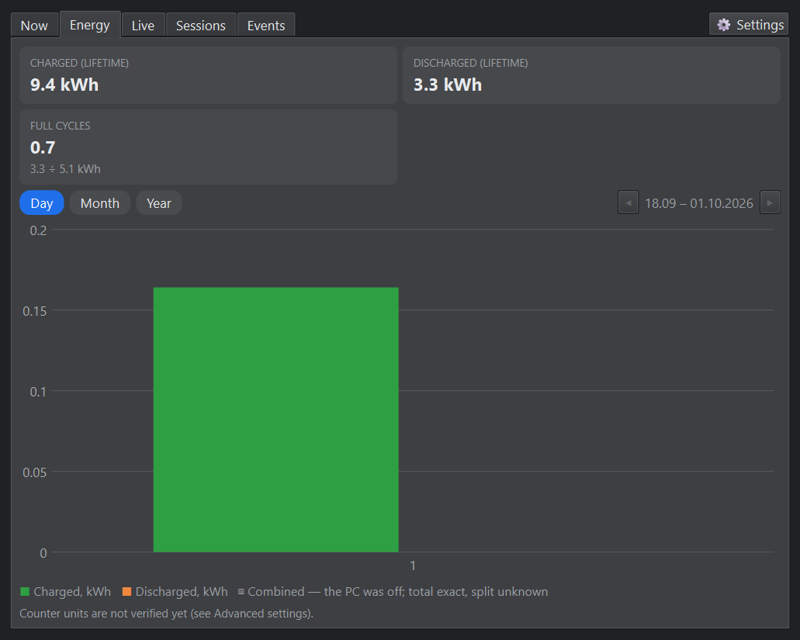
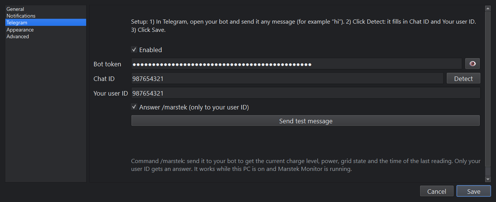
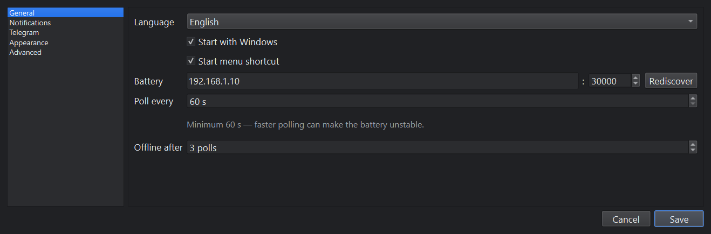
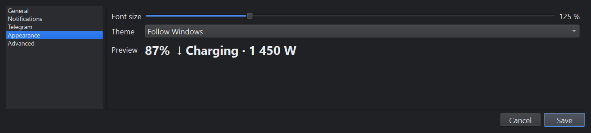
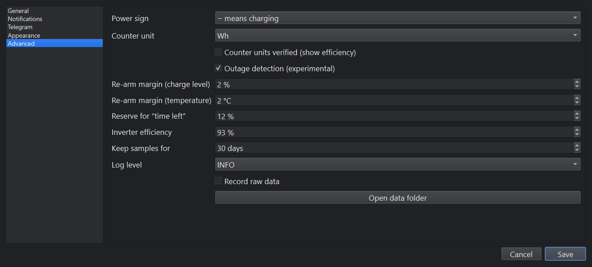

# Marstek Monitor: user guide

[Українська версія](user-guide.uk.md)

Marstek Monitor is a small Windows app that sits in the system tray and watches a
**Marstek Venus E 3.0** home battery over your home network. It shows how full the battery is,
whether it is charging or supplying power, how long the backup will last during a power outage,
and it sends notifications to your desktop and, if you want, to Telegram.

The app **only reads** from the battery. It never changes any battery setting.

- [1. What you need](#1-what-you-need)
- [2. Install and first start](#2-install-and-first-start)
- [3. The tray icon](#3-the-tray-icon)
- [4. The monitor window](#4-the-monitor-window)
- [5. Notifications](#5-notifications)
- [6. Telegram](#6-telegram)
- [7. Settings](#7-settings)
- [8. Grid outages and backup time](#8-grid-outages-and-backup-time)
- [9. Your data](#9-your-data)
- [10. Troubleshooting](#10-troubleshooting)
- [11. Update and uninstall](#11-update-and-uninstall)

## 1. What you need

- A Windows 11 PC on the same home network (Wi-Fi or cable) as the battery.
- The battery's **Local API** turned on in the Marstek app. The default port is UDP 30000; leave
  it unless you changed it there.
- For backup monitoring: the PC (or whatever you want to watch) is plugged into the battery's
  backup socket.

## 2. Install and first start

1. Download `MarstekMonitor-<version>-win64.zip` from the
   [Releases](https://github.com/yep-it/windows-marstek-venus-e-monitor/releases) page.
2. Unzip it anywhere, for example to `C:\Programs`. Keep the whole `MarstekMonitor` folder together:
   the exe needs the files next to it.
3. Run `MarstekMonitor.exe`. The exe is not code-signed, so Windows SmartScreen may say
   "Windows protected your PC". Click **More info → Run anyway**.
4. When Windows Firewall asks whether the app may communicate on **private networks**, allow it.
   Without this, the battery's replies are blocked and the app shows "Battery not responding".

The app has no main window: it starts in the tray, next to the clock. If you don't see the icon,
click the **^** arrow in the taskbar and drag the battery icon onto the taskbar to keep it visible.

On the first start the app searches your network for the battery, so you normally don't need to
enter an IP address. If it cannot find it, enter the address in **Settings → General → Battery**
(see [Troubleshooting](#10-troubleshooting)).

Starting `MarstekMonitor.exe` again while it is already running just opens the monitor window;
only one copy runs at a time.

## 3. The tray icon

The icon is a small battery filled to the current charge level.

| Icon | Meaning |
|---|---|
|  | Normal. Green fill above 40 %. |
|  | Low. Orange fill from 20 to 40 %, red below 20 %. |
|  | Charging (yellow bolt). |
|  | **Grid outage**: red outline, your devices are running on the battery only. Needs outage detection, see [section 8](#8-grid-outages-and-backup-time). |
|  | The battery does not answer (grey cross). |
|  | An app problem, for example a network error. Open the monitor to see what it is. |

- **Hover** over the icon to see a short status, for example
  `Marstek Venus E · 89% · ↑ Supplying · 93 W · On battery · 22:43`.
- **Click** the icon to open the monitor window.
- **Right-click** it for **Open monitor**, **Settings** and **Exit**.

Closing the monitor window only hides it; the app keeps watching the battery. To stop the app,
use **Exit** in the tray menu.

## 4. The monitor window

The window has five tabs. The **⚙ Settings** button at the top right opens the settings.
The window remembers its size and position.

### Now

- **Banners** at the top warn about important states: a grid outage, the battery not
  responding, charging or discharging blocked by the battery, or a temperature outside the safe range.
- **Grid line**: `● Grid connected` or `⚡ Grid outage since 18:15 (4 h 28 min)`. It is shown only
  when outage detection is on. While the battery is idle and nothing is plugged into the backup
  socket, the readings look the same with and without the grid, so the line shows
  `● Grid: unknown (battery idle, nothing on backup)`.
- **Charge level** in big numbers, and what the battery is doing right now: `↓ Charging`,
  `↑ Supplying` or `Idle`, with the power.
- **Time estimate**: while charging, `full in ≈ …`; while supplying power, `≈ … left at this load`
  (see [section 8](#8-grid-outages-and-backup-time)).
- **Stored energy**, for example `4.56 of 5.12 kWh`, and a bar.
- **Tiles**: battery temperature, **backup load** (the power drawn from the backup socket),
  whether the battery allows charging and discharging, and the firmware version.
- **Current session**: the charge or discharge that is going on now, from which level, how long
  and how much energy so far. `≤` and `≥` mean the session started before the app was running,
  so the real values are at least that large.
- **Footer**: the battery model and IP address, and when the last reading arrived.

### Energy

- **Charged / Discharged (lifetime)**: the battery's own lifetime counters.
- **Full cycles**: lifetime discharged energy divided by the capacity.
- **Round-trip efficiency** (discharged ÷ charged) appears only after you confirmed the counter
  units, see [Advanced](#advanced).
- The chart shows the energy per **Day**, **Month** or **Year**. The ◀ ▶ arrows move to earlier
  or later periods. Hover over a bar for its exact values.
- A **hatched bar** covers a time when the PC was off: the total is exact, but how it splits
  between days is unknown.

Note: in the battery's counters, discharged energy does not include what the backup socket
supplied. The energy of outage sessions on the Sessions tab is calculated from power × time instead.

### Live

A chart of the readings since the app started: the **blue line** is the charge level (left axis);
the area below and above zero is the power (right axis), **green** for charging and **orange**
for supplying. **Grey** areas mean no data, for example when the PC was off. An orange dashed
vertical line marks the start of a grid outage. Choose **1 h**, **3 h**, **6 h** or
**Since start**. Hover over the chart to see the value at that time.

### Sessions

A **session** is one continuous charge or discharge.

- **Typical full charge**: the average time for 20 → 100 % over the last 5 charges.
- **Longest backup**: the longest finished discharge that the app saw from start to end.
- Filter by **All**, **Charging**, **Discharging** or **Outages only**, and choose the period at the
  right (7, 30 or 90 days, or all time).

Each session shows its time, charge level from → to, duration, energy and average power, plus:

- **cause**: `outage` (the grid was lost), `after outage` (a charge that began within 30 minutes
  after the grid came back), `after full discharge` (a charge that began near the reserve level)
  or `other`;
- **quality**: `✓ complete`, or a warning when the app did not see the whole session:
  `started before the app`, `ended while the app was off` or `gap in data`. In those cases the
  values are minimums.

### Events

Everything the app notified you about, plus system messages, newest first. Filter by **All**,
**Critical**, **Notifications** or **System**, or search. The symbols on the right show how each
notification was delivered: 🖥 desktop, ✈ Telegram, ✓ sent, 🌙 held back by quiet hours,
⟳ retried, ✕ failed.

## 5. Notifications

All notifications are set up in **Settings → Notifications**.

Each row has:

- **On**: whether this notification is used at all.
- **Threshold**: the value it reacts to, if it has one.
- 🖥 **desktop** and ✈ **Telegram**: where it goes.
- **Repeat**: remind again at this interval while the condition lasts. `off` means notify once.
- **Test**: sends a sample now, through the ticked channels.

| Notification | When it fires |
|---|---|
| **Charge level below** | The charge level drops **below** the threshold. With 90 % it fires at 89 %. You can have up to 3 levels (**+ add level**), each normal or critical. |
| **Charge level reached** | The charge level reaches the threshold, for example 100 % = full. |
| **Grid lost / restored** (experimental) | The grid failed and the battery took over, and when the grid is back (with the outage length). |
| **Backup time left below** (experimental) | During an outage, the estimated time left at the current load drops below the threshold. |
| **Charge / Discharge session finished** | A session ended: charge level from → to, duration, energy. |
| **Battery not responding / back online** | Several readings in a row failed (General → Offline after), and when it answers again. |
| **Charging / discharging blocked** | The battery itself refuses to charge or to discharge. If discharging is blocked, **backup will not work** during an outage. |
| **Temperature above / below** | The battery temperature is above the first value or below the second. |
| **Firmware version changed** | Marstek updated the battery's firmware. |
| **Monitor started / stopped** (Telegram only) | The app started or was closed, so you know whether monitoring is running. |

**Normal and critical.** Critical notifications have a red 🔴 mark, ring on the phone in
Telegram, and are shown even during quiet hours. Normal ones have a blue 🔵 mark and arrive in
Telegram silently. Clicking a desktop notification opens the matching tab.

**Re-arm.** A threshold notification fires once. It can fire again only after the value has
moved back past the threshold by the re-arm margin (**Advanced**, 2 % by default). This prevents
a stream of notifications when the level hovers around the threshold. Use **Repeat** if you want
reminders.

**Quiet hours** (top of the page): between the two times, normal desktop notifications are
not shown (they are still listed in Events with 🌙). **critical always get through** lets critical
ones through. **also silence Telegram** holds back normal Telegram messages too.

The "experimental" rows work only when **Advanced → Outage detection** is on.

## 6. Telegram

Telegram lets you get the notifications on your phone, and ask for the battery status with the
`/marstek` command.

1. In Telegram, open **@BotFather**, send `/newbot`, and follow the steps. BotFather gives you a
   **bot token**. Keep it secret: anyone with the token can control the bot.
2. In **Settings → Telegram**, tick **Enabled** and paste the token into **Bot token**. The 👁
   button shows or hides it.
3. In Telegram, open your new bot and send it any message, for example "hi".
4. Click **Detect**. It fills in **Chat ID** and **Your user ID**.
5. Click **Save**, then **Send test message** to check that it arrives.
6. In **Notifications**, tick ✈ for the notifications you want in Telegram.

**/marstek command.** Send `/marstek` to your bot to get the current charge level, power, grid
state and the time of the last reading. Only **Your user ID** gets an answer; messages from
anyone else are ignored and listed in Events. It works only while the PC is on and the app is
running, and only if **Answer /marstek** is ticked.

The token and IDs are stored in plain text in `settings.json` on your PC (see [Your data](#9-your-data)).

## 7. Settings

Hover over any setting to see an explanation. Changes apply when you click **Save**; **Cancel**
discards them.

### General

- **Language**: English or Ukrainian, for the windows, notifications and Telegram messages.
- **Start with Windows**: start the app automatically when you sign in.
- **Start menu shortcut**: keep a "Marstek Monitor" shortcut in the Start menu.
- **Battery**: the battery's IP address and Local API port. **Rediscover** searches the network
  for the battery again, for example after your router gave it a new address.
- **Poll every**: how often the app reads the battery. The minimum is 60 seconds; faster polling
  can make the battery's Local API unstable.
- **Offline after**: how many failed readings in a row count as "Battery not responding".

### Notifications and Telegram

See [section 5](#5-notifications) and [section 6](#6-telegram).

### Appearance

- **Font size**: the text size in all app windows (100–200 %), with a preview.
- **Theme**: **Follow Windows**, **Light** or **Dark**.

### Advanced

- **Power sign**: which sign of the battery's power reading means charging. The default
  (− means charging) was checked on a real battery. Change it only if the Now tab shows
  "Supplying" while the battery is charging.
- **Counter unit**: the unit of the battery's lifetime counters. Change it if the Energy totals
  differ from the Marstek app by ×10, ×100 or ×1000.
- **Counter units verified**: tick it once the Energy totals match the Marstek app. This shows the
  efficiency card.
- **Outage detection (experimental)**: recognizes grid outages from the battery data
  ([section 8](#8-grid-outages-and-backup-time)).
- **Re-arm margin (charge level / temperature)**: see re-arm in [section 5](#5-notifications).
- **Reserve for "time left"**: the level the battery never discharges below. Marstek's default
  discharge limit (DOD 88 %) keeps 12 %.
- **Inverter efficiency**: the share of the battery's energy that reaches the backup socket.
  Used for "time left" until the app has measured the real drain.
- **Keep samples for**: how long the per-minute readings for the Live tab are kept. Sessions,
  energy totals and events are kept separately.
- **Log level**: how much detail goes into the log file. Leave it at INFO unless you investigate a problem.
- **Record raw data**: save every raw battery reply to the logs folder, for troubleshooting.
- **Open data folder**: opens the folder with the settings, history and logs.

## 8. Grid outages and backup time

Turn on **Settings → Advanced → Outage detection**, then **Grid lost / restored** in Notifications.

**How an outage is recognized.** The battery reports no grid exchange while it feeds a load on
the backup socket and its stored energy is below full. Two readings in a row are needed, so the
notification comes one or two minutes after the outage starts. The start time is the first of
those readings.

**Limitations:**

- **When the battery is full**, an outage looks exactly like normal grid passthrough. The app
  notices it only once the stored energy starts to drop, a few minutes after the outage began.
- An outage with **nothing plugged into the backup socket** cannot be detected.
- The app does not remember an ongoing outage across restarts: if it starts during an outage, it
  sends "Grid lost" again and counts the outage from its own start.

**Time left at this load.** While the battery supplies power, the app estimates how long it
lasts:

> time left = (stored energy − reserve) ÷ (load ÷ efficiency)

- The **reserve** (12 % by default) is the part the battery keeps for itself.
- The **efficiency** accounts for the inverter's losses. At first the app uses the
  **Inverter efficiency** setting (93 %). After about 30 minutes of supplying power it measures
  the real drain, from how fast the stored energy actually falls compared to the load, and uses
  that instead.
- The estimate follows the **current** load: plug in something bigger and it drops at once.

## 9. Your data

Everything stays on your PC, in `%APPDATA%\MarstekMonitor` (Advanced → **Open data folder**):

| File | Contents |
|---|---|
| `settings.json` | Your settings, including the Telegram token and IDs, in plain text. |
| `history.db` | Readings, sessions, energy counters and events. |
| `window_state.json` | Window sizes and positions. |
| `logs\app.log` | The log file. With **Record raw data**, also `logs\raw-YYYYMMDD.jsonl`. |

The app talks only to the battery on your network and, if you set it up, to Telegram's servers.

## 10. Troubleshooting

**"Battery not responding" or "Waiting for data…"**

- Check that the battery is on and connected to your home network (Wi-Fi or cable), and that the
  PC is on the same network.
- Check that the Local API is turned on in the Marstek app.
- Allow the app in Windows Firewall for private networks. If you clicked "Cancel" at the first
  start, open *Windows Security → Firewall & network protection → Allow an app through firewall*
  and tick **Private** for MarstekMonitor.
- Your router may have given the battery a new address: click **Settings → General → Rediscover**,
  or enter the address shown in your router or in the Marstek app.

**"UDP port … is used by another program"**: another app uses the port Marstek Monitor needs.
Close it, or check that a second copy is not started some other way.

**No desktop notifications**: check Windows *Settings → System → Notifications* and Do Not
Disturb, and the app's quiet hours.

**Telegram doesn't work**

- "Telegram rejected the bot token": copy the token from BotFather again.
- "No messages found": send a message to your bot first, then click **Detect**.
- `/marstek` gets no answer: the app must be running, **Answer /marstek** ticked and
  **Your user ID** filled in.

**Two "Grid lost" notifications for one outage**: the app was restarted during the outage, see
[section 8](#8-grid-outages-and-backup-time).

**Wrong numbers on the Energy tab**: see **Counter unit** in [Advanced](#advanced).

If something else goes wrong, the log file `logs\app.log` usually says why.

## 11. Update and uninstall

**Update:** exit the app from the tray menu, then replace the `MarstekMonitor` folder with the
new one. Settings and history stay in `%APPDATA%\MarstekMonitor`.

**Uninstall:**

1. In Settings, untick **Start with Windows** and **Start menu shortcut**, and click **Save**.
2. Exit the app from the tray menu.
3. Delete the `MarstekMonitor` folder.
4. If you also want to remove your settings and history, delete `%APPDATA%\MarstekMonitor`.
