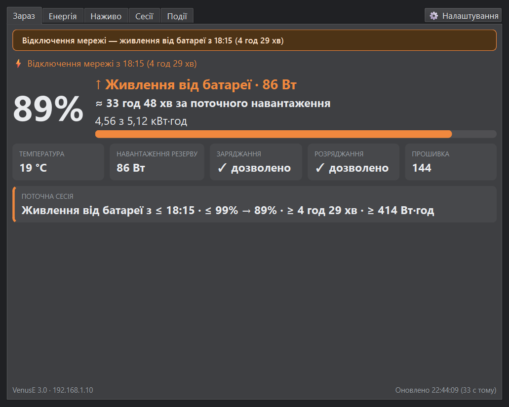
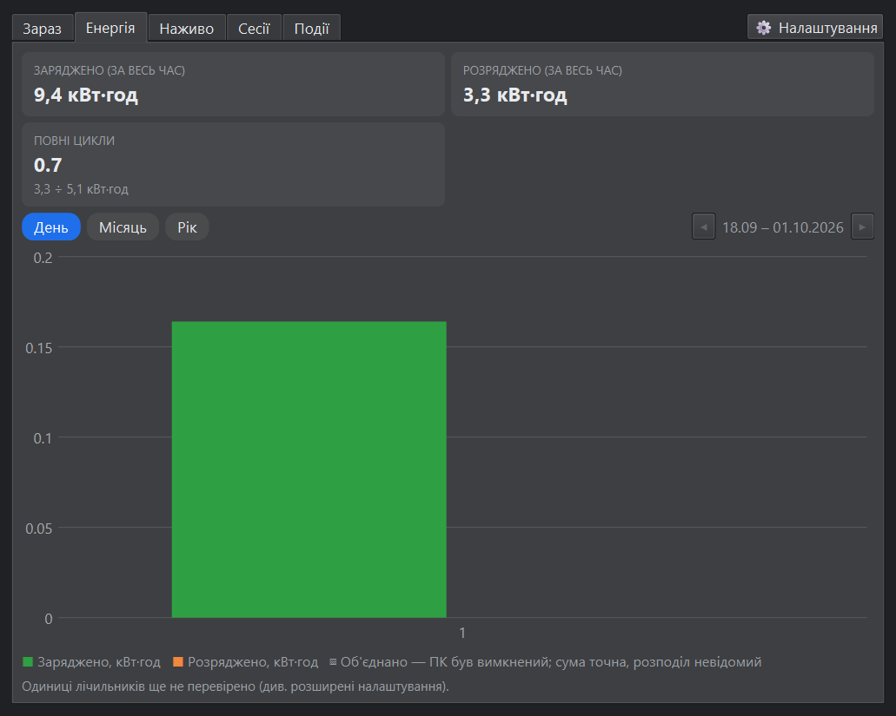
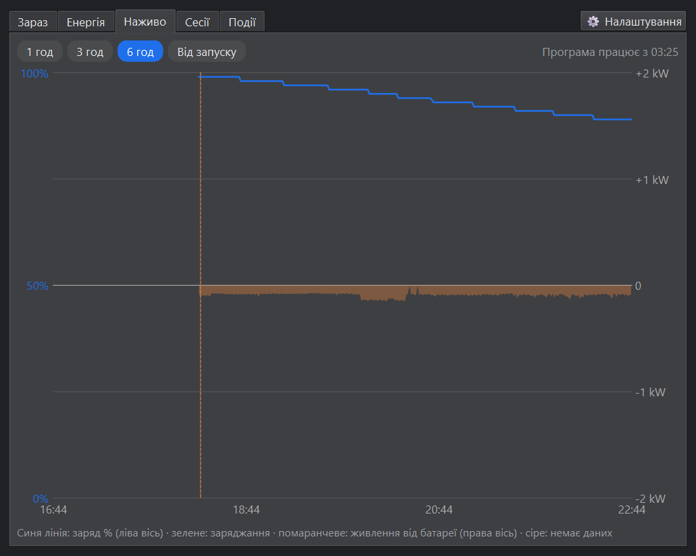
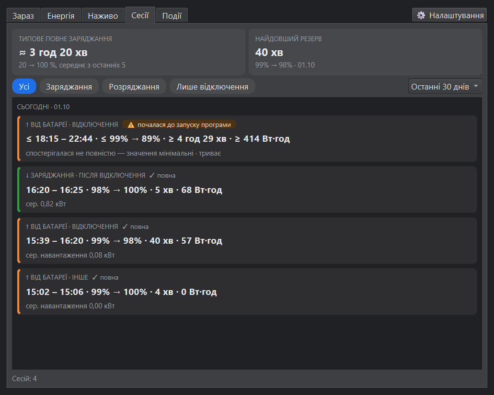
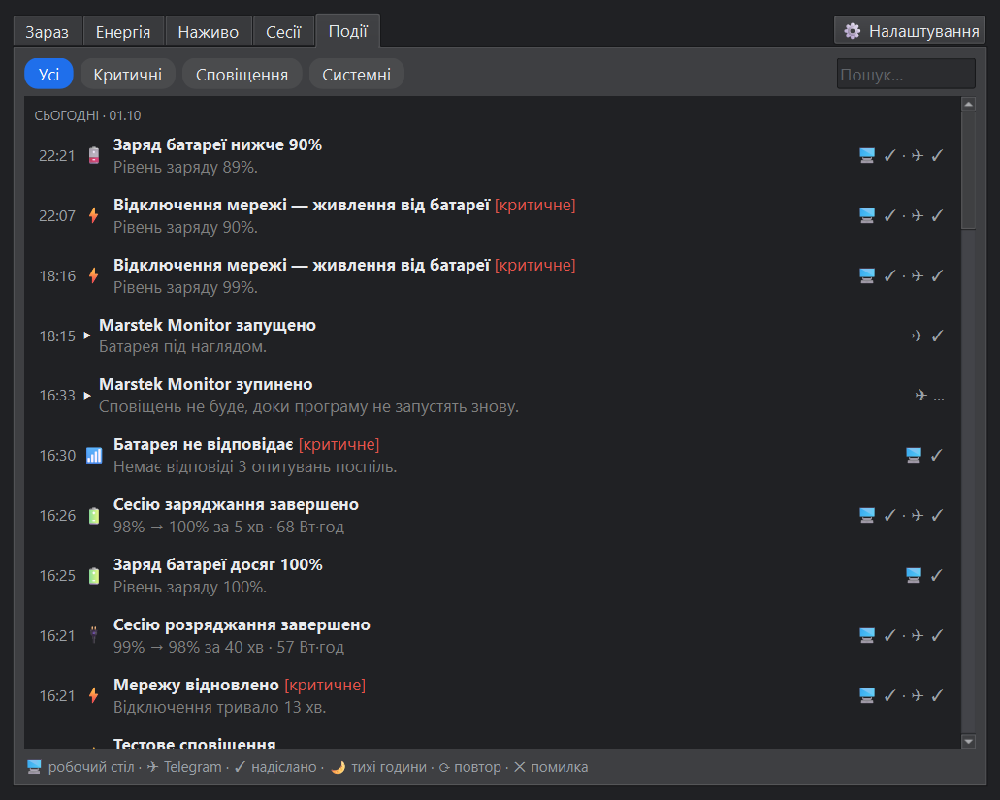
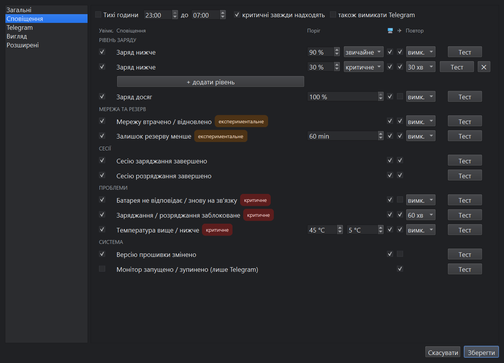
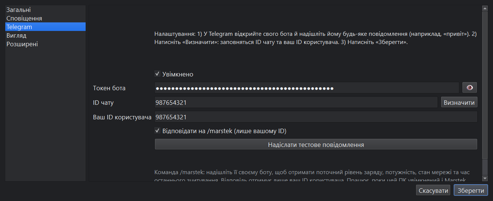
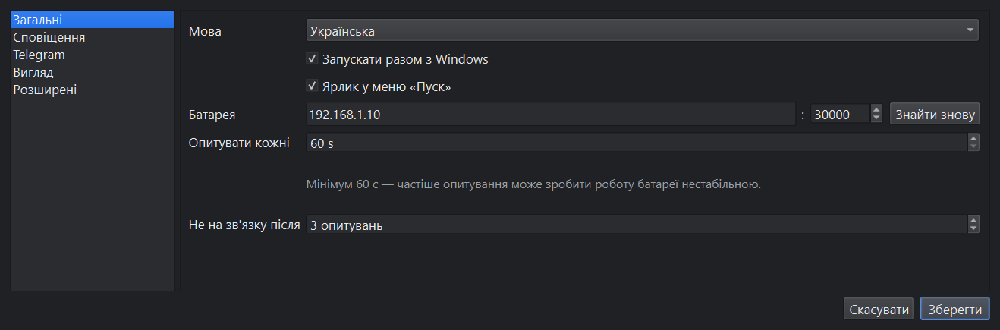
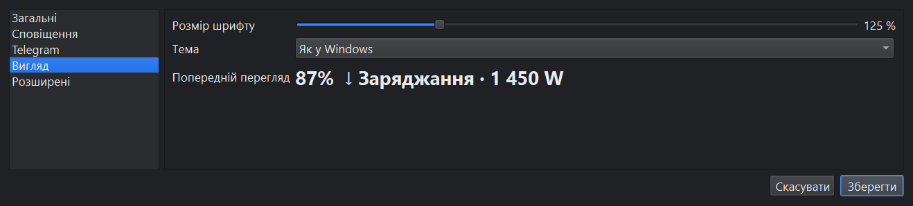
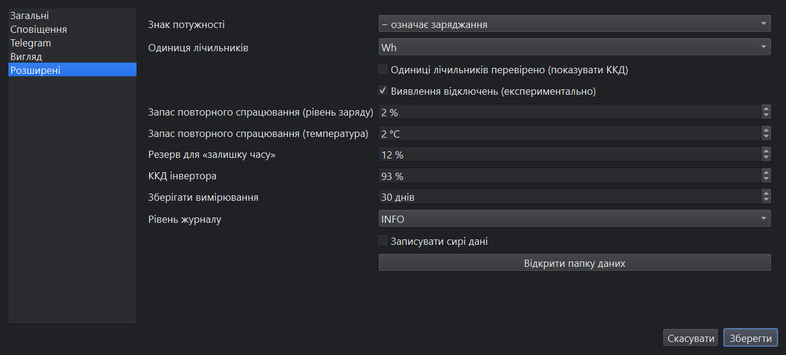

# Marstek Monitor: посібник користувача

[English version](user-guide.md)

Marstek Monitor — невелика програма для Windows, яка працює в системному треї та стежить за
домашньою батареєю **Marstek Venus E 3.0** через домашню мережу. Вона показує, наскільки
заряджена батарея, чи вона заряджається, чи живить пристрої, скільки протримається резерв під
час відключення світла, і надсилає сповіщення на робочий стіл та, за бажанням, у Telegram.

Програма **лише читає** дані з батареї. Вона ніколи не змінює жодних налаштувань батареї.

- [1. Що потрібно](#1-що-потрібно)
- [2. Встановлення і перший запуск](#2-встановлення-і-перший-запуск)
- [3. Значок у треї](#3-значок-у-треї)
- [4. Вікно монітора](#4-вікно-монітора)
- [5. Сповіщення](#5-сповіщення)
- [6. Telegram](#6-telegram)
- [7. Налаштування](#7-налаштування)
- [8. Відключення мережі та час резерву](#8-відключення-мережі-та-час-резерву)
- [9. Ваші дані](#9-ваші-дані)
- [10. Розв'язання проблем](#10-розвязання-проблем)
- [11. Оновлення і видалення](#11-оновлення-і-видалення)

## 1. Що потрібно

- ПК з Windows 11 у тій самій домашній мережі (Wi-Fi або кабель), що й батарея.
- Увімкнений **Local API** батареї в застосунку Marstek. Типовий порт — UDP 30000; не змінюйте
  його, якщо не змінювали там.
- Для контролю резерву: ПК (або те, за чим ви хочете стежити) під'єднаний до резервної розетки
  батареї.

## 2. Встановлення і перший запуск

1. Завантажте `MarstekMonitor-<версія>-win64.zip` зі сторінки
   [Releases](https://github.com/yep-it/windows-marstek-venus-e-monitor/releases).
2. Розпакуйте його будь-куди, наприклад у `C:\Programs`. Тримайте всю папку `MarstekMonitor`
   разом: exe потрібні файли поруч із ним.
3. Запустіть `MarstekMonitor.exe`. Exe не має цифрового підпису, тому Windows SmartScreen може
   показати «Windows захистив ваш ПК». Натисніть **Докладніше → Усе одно запустити**.
4. Коли брандмауер Windows запитає, чи дозволити програмі обмін даними в **приватних мережах**,
   дозвольте. Без цього відповіді батареї блокуються, і програма показує «Батарея не відповідає».

Головного вікна немає: програма запускається в треї, біля годинника. Якщо значка не видно,
натисніть стрілку **^** на панелі завдань і перетягніть значок батареї на панель, щоб він був
завжди видимий.

Під час першого запуску програма сама шукає батарею в мережі, тому вводити IP-адресу зазвичай
не потрібно. Якщо вона не знаходить батарею, введіть адресу в **Налаштування → Загальні →
Батарея** (див. [Розв'язання проблем](#10-розвязання-проблем)).

Повторний запуск `MarstekMonitor.exe`, коли програма вже працює, просто відкриває вікно
монітора: одночасно працює лише одна копія.

## 3. Значок у треї

Значок — маленька батарея, заповнена до поточного рівня заряду.

| Значок | Що означає |
|---|---|
|  | Звичайний стан. Зелене заповнення, понад 40 %. |
|  | Низький заряд. Помаранчеве заповнення від 20 до 40 %, червоне нижче 20 %. |
|  | Заряджання (жовта блискавка). |
|  | **Відключення мережі**: червоний контур, ваші пристрої живляться лише від батареї. Потрібне виявлення відключень, див. [розділ 8](#8-відключення-мережі-та-час-резерву). |
|  | Батарея не відповідає (сірий хрестик). |
|  | Проблема програми, наприклад помилка мережі. Відкрийте монітор, щоб побачити, яка саме. |

- **Наведіть** курсор на значок, щоб побачити короткий стан, наприклад
  `Marstek Venus E · 89% · ↑ Живлення від батареї · 93 Вт · Від батареї · 22:43`.
- **Клацніть** значок, щоб відкрити вікно монітора.
- **Клацніть правою кнопкою**, щоб вибрати **Відкрити монітор**, **Налаштування** або **Вийти**.

Закриття вікна монітора лише ховає його; програма продовжує стежити за батареєю. Щоб зупинити
програму, виберіть **Вийти** в меню трею.

## 4. Вікно монітора

У вікні п'ять вкладок. Кнопка **⚙ Налаштування** вгорі праворуч відкриває налаштування.
Вікно запам'ятовує свій розмір і положення.

### Зараз

- **Банери** вгорі попереджають про важливе: відключення мережі, батарея не відповідає,
  заряджання чи розряджання заблоковане батареєю, температура поза безпечним діапазоном.
- **Рядок мережі**: `● Мережа підключена` або `⚡ Відключення мережі з 18:15 (4 год 28 хв)`.
  Показується, лише коли увімкнене виявлення відключень. Коли батарея в очікуванні, а до резервної
  розетки нічого не під'єднано, показники однакові з мережею і без неї, тому рядок показує
  `● Мережа: невідомо (батарея в очікуванні, резервна розетка без навантаження)`.
- **Рівень заряду** великими цифрами і що батарея робить зараз: `↓ Заряджання`,
  `↑ Живлення від батареї` або `Очікування`, з потужністю.
- **Оцінка часу**: під час заряджання — `повна через ≈ …`; під час живлення —
  `≈ … за поточного навантаження` (див. [розділ 8](#8-відключення-мережі-та-час-резерву)).
- **Збережена енергія**, наприклад `4,56 з 5,12 кВт·год`, і смуга.
- **Плитки**: температура батареї, **навантаження резерву** (потужність, яку бере резервна
  розетка), чи дозволяє батарея заряджання і розряджання, версія прошивки.
- **Поточна сесія**: заряджання чи розряджання, що триває зараз, — з якого рівня, скільки часу і
  скільки енергії. `≤` і `≥` означають, що сесія почалася до запуску програми, тож справжні
  значення щонайменше такі.
- **Нижній рядок**: модель і IP-адреса батареї та час останнього зчитування.

### Енергія

- **Заряджено / Розряджено (за весь час)**: власні лічильники батареї.
- **Повні цикли**: розряджена за весь час енергія, поділена на ємність.
- **ККД заряд-розряд** (розряджено ÷ заряджено) з'являється лише після того, як ви підтвердили
  одиниці лічильників, див. [Розширені](#розширені).
- Графік показує енергію за **День**, **Місяць** або **Рік**. Стрілки ◀ ▶ перемикають на ранніші
  або пізніші періоди. Наведіть курсор на стовпчик, щоб побачити точні значення.
- **Заштрихований стовпчик** охоплює час, коли ПК був вимкнений: сума точна, але як вона
  розподіляється між днями, невідомо.

Зауважте: у лічильниках батареї розряджена енергія не враховує того, що віддала резервна
розетка. Енергію сесій відключення на вкладці «Сесії» програма рахує як потужність × час.

### Наживо

Графік зчитувань від запуску програми: **синя лінія** — рівень заряду (ліва вісь); область вище
і нижче нуля — потужність (права вісь), **зелена** для заряджання і **помаранчева** для живлення
від батареї. **Сірі** ділянки — немає даних, наприклад коли ПК був вимкнений. Помаранчева
пунктирна вертикальна лінія позначає початок відключення мережі. Виберіть **1 год**, **3 год**,
**6 год** або **Від запуску**. Наведіть курсор на графік, щоб побачити значення в той момент.

### Сесії

**Сесія** — одне безперервне заряджання або розряджання.

- **Типове повне заряджання**: середній час 20 → 100 % за останні 5 заряджань.
- **Найдовший резерв**: найдовше завершене розряджання, яке програма бачила від початку до кінця.
- Фільтр: **Усі**, **Заряджання**, **Розряджання** або **Лише відключення**; період вибирається
  праворуч (7, 30 чи 90 днів або за весь час).

Кожна сесія показує час, рівень заряду з → до, тривалість, енергію і середню потужність, а також:

- **причину**: `відключення` (мережу втрачено), `після відключення` (заряджання, що почалося
  протягом 30 хвилин після повернення мережі), `після повного розряду` (заряджання, що почалося
  біля рівня резерву) або `інше`;
- **якість**: `✓ повна` або попередження, якщо програма бачила не всю сесію:
  `почалася до запуску програми`, `завершилася, коли програма не працювала` або
  `пропуск у даних`. У цих випадках значення — мінімальні.

### Події

Усе, про що програма вас сповіщала, а також системні повідомлення, найновіші вгорі. Фільтр:
**Усі**, **Критичні**, **Сповіщення** або **Системні**, є пошук. Символи праворуч показують, як
доставлено кожне сповіщення: 🖥 робочий стіл, ✈ Telegram, ✓ надіслано, 🌙 затримано тихими
годинами, ⟳ повтор, ✕ помилка.

## 5. Сповіщення

Усі сповіщення налаштовуються в **Налаштування → Сповіщення**.

У кожному рядку є:

- **Увімк.**: чи використовується це сповіщення взагалі.
- **Поріг**: значення, на яке воно реагує, якщо є.
- 🖥 **робочий стіл** і ✈ **Telegram**: куди воно надходить.
- **Повтор**: нагадувати знову з таким інтервалом, поки умова триває. `вимк.` — сповістити один раз.
- **Тест**: надсилає зразок зараз, через позначені канали.

| Сповіщення | Коли спрацьовує |
|---|---|
| **Заряд нижче** | Рівень заряду падає **нижче** порогу. З порогом 90 % воно спрацює на 89 %. Можна мати до 3 рівнів (**+ додати рівень**), кожен звичайний або критичний. |
| **Заряд досяг** | Рівень заряду досягає порогу, наприклад 100 % = повністю заряджено. |
| **Мережу втрачено / відновлено** (експериментальне) | Мережа зникла і батарея взяла живлення на себе, а також коли мережа повернулася (з тривалістю відключення). |
| **Залишок резерву менше** (експериментальне) | Під час відключення оцінений залишок часу за поточного навантаження падає нижче порогу. |
| **Сесію заряджання / розряджання завершено** | Сесія закінчилася: рівень заряду з → до, тривалість, енергія. |
| **Батарея не відповідає / знову на зв'язку** | Кілька зчитувань поспіль не вдалися (Загальні → Не на зв'язку після), і коли батарея знову відповідає. |
| **Заряджання / розряджання заблоковане** | Батарея сама відмовляється заряджатися або розряджатися. Якщо заблоковане розряджання, **резерв не спрацює** під час відключення. |
| **Температура вище / нижче** | Температура батареї вища за перше значення або нижча за друге. |
| **Версію прошивки змінено** | Marstek оновив прошивку батареї. |
| **Монітор запущено / зупинено** (лише Telegram) | Програма запустилася або її закрили, тож ви знаєте, чи працює моніторинг. |

**Звичайні і критичні.** Критичні сповіщення мають червону позначку 🔴, дзвонять на телефоні в
Telegram і показуються навіть у тихі години. Звичайні мають синю позначку 🔵 і надходять у
Telegram без звуку. Клацання на сповіщенні на робочому столі відкриває відповідну вкладку.

**Повторне спрацювання.** Сповіщення з порогом спрацьовує один раз. Знову воно може спрацювати
лише після того, як значення повернеться за поріг на запас повторного спрацювання
(**Розширені**, типово 2 %). Це не дає сповіщенням сипатися, коли рівень коливається біля порогу.
Якщо потрібні нагадування, використовуйте **Повтор**.

**Тихі години** (угорі сторінки): між двома значеннями часу звичайні сповіщення на робочому столі
не показуються (вони все одно є в «Подіях» із 🌙). **критичні завжди надходять** пропускає
критичні. **також вимикати Telegram** затримує і звичайні повідомлення в Telegram.

Рядки з позначкою «експериментальне» працюють, лише коли увімкнено **Розширені → Виявлення
відключень**.

## 6. Telegram

Telegram дає змогу отримувати сповіщення на телефон і запитувати стан батареї командою `/marstek`.

1. У Telegram відкрийте **@BotFather**, надішліть `/newbot` і виконайте кроки. BotFather видасть
   **токен бота**. Тримайте його в таємниці: будь-хто з токеном може керувати ботом.
2. У **Налаштування → Telegram** позначте **Увімкнено** і вставте токен у поле **Токен бота**.
   Кнопка 👁 показує або ховає його.
3. У Telegram відкрийте свого нового бота й надішліть йому будь-яке повідомлення, наприклад «привіт».
4. Натисніть **Визначити**. Заповняться **ID чату** та **Ваш ID користувача**.
5. Натисніть **Зберегти**, потім **Надіслати тестове повідомлення**, щоб перевірити, що воно надходить.
6. У **Сповіщеннях** позначте ✈ для тих сповіщень, які хочете отримувати в Telegram.

**Команда /marstek.** Надішліть `/marstek` своєму боту, щоб отримати поточний рівень заряду,
потужність, стан мережі та час останнього зчитування. Відповідь отримує лише **Ваш ID
користувача**; повідомлення від інших ігноруються і записуються в «Події». Працює, лише поки ПК
увімкнений і програма запущена, і лише якщо позначено **Відповідати на /marstek**.

Токен та ID зберігаються відкритим текстом у `settings.json` на вашому ПК (див. [Ваші дані](#9-ваші-дані)).

## 7. Налаштування

Наведіть курсор на будь-яке налаштування, щоб побачити пояснення. Зміни застосовуються після
**Зберегти**; **Скасувати** їх відкидає.

### Загальні

- **Мова**: англійська або українська — для вікон, сповіщень і повідомлень у Telegram.
- **Запускати разом з Windows**: автоматично запускати програму після входу в Windows.
- **Ярлик у меню «Пуск»**: тримати ярлик «Marstek Monitor» у меню «Пуск».
- **Батарея**: IP-адреса батареї та порт Local API. **Знайти знову** знову шукає батарею в
  мережі, наприклад якщо роутер видав їй нову адресу.
- **Опитувати кожні**: як часто програма зчитує батарею. Мінімум 60 секунд: частіше опитування
  може зробити Local API батареї нестабільним.
- **Не на зв'язку після**: скільки невдалих зчитувань поспіль вважати «Батарея не відповідає».

### Сповіщення і Telegram

Див. [розділ 5](#5-сповіщення) і [розділ 6](#6-telegram).

### Вигляд

- **Розмір шрифту**: розмір тексту в усіх вікнах програми (100–200 %), з попереднім переглядом.
- **Тема**: **Як у Windows**, **Світла** або **Темна**.

### Розширені

- **Знак потужності**: який знак показника потужності батареї означає заряджання. Типове значення
  (− означає заряджання) перевірене на справжній батареї. Змінюйте, лише якщо вкладка «Зараз»
  показує «Живлення від батареї», коли батарея заряджається.
- **Одиниця лічильників**: одиниця лічильників батареї за весь час. Змініть, якщо підсумки на
  вкладці «Енергія» відрізняються від застосунку Marstek у 10, 100 або 1000 разів.
- **Одиниці лічильників перевірено**: позначте, коли підсумки на вкладці «Енергія» збігаються із
  застосунком Marstek. Тоді з'явиться картка ККД.
- **Виявлення відключень (експериментально)**: розпізнає відключення мережі за даними батареї
  ([розділ 8](#8-відключення-мережі-та-час-резерву)).
- **Запас повторного спрацювання (рівень заряду / температура)**: див. «Повторне спрацювання» в
  [розділі 5](#5-сповіщення).
- **Резерв для «залишку часу»**: рівень, нижче якого батарея ніколи не розряджається. Типове
  обмеження розряду Marstek (DOD 88 %) залишає 12 %.
- **ККД інвертора**: частка енергії батареї, що доходить до резервної розетки. Використовується
  для «залишку часу», доки програма не виміряє справжню витрату.
- **Зберігати вимірювання**: скільки зберігати щохвилинні зчитування для вкладки «Наживо».
  Сесії, підсумки енергії та події зберігаються окремо.
- **Рівень журналу**: скільки подробиць пишеться в журнал. Залиште INFO, якщо не шукаєте проблему.
- **Записувати сирі дані**: зберігати кожну сиру відповідь батареї в папку журналів, для
  діагностики.
- **Відкрити папку даних**: відкриває папку з налаштуваннями, історією та журналами.

## 8. Відключення мережі та час резерву

Увімкніть **Налаштування → Розширені → Виявлення відключень**, а потім **Мережу втрачено /
відновлено** у «Сповіщеннях».

**Як розпізнається відключення.** Батарея не показує обміну з мережею, водночас живить
навантаження на резервній розетці, а збережена енергія нижча за повну. Потрібні два зчитування
поспіль, тому сповіщення приходить через одну-дві хвилини після початку відключення. Часом
початку вважається перше з цих зчитувань.

**Обмеження:**

- **Коли батарея повна**, відключення виглядає так само, як звичайне живлення з мережі напряму.
  Програма помічає його, лише коли збережена енергія починає зменшуватися, — за кілька хвилин
  після початку відключення.
- Відключення, коли **до резервної розетки нічого не під'єднано**, виявити неможливо.
- Програма не пам'ятає відключення, що триває, після перезапуску: якщо вона запускається під час
  відключення, то знову надсилає «Мережу втрачено» і рахує відключення від свого запуску.

**Залишок часу за поточного навантаження.** Поки батарея живить пристрої, програма оцінює,
на скільки її вистачить:

> залишок часу = (збережена енергія − резерв) ÷ (навантаження ÷ ККД)

- **Резерв** (типово 12 %) — частина, яку батарея залишає собі.
- **ККД** враховує втрати в інверторі. Спочатку програма бере налаштування **ККД інвертора**
  (93 %). Приблизно через 30 хвилин живлення вона вимірює справжню витрату — наскільки швидко
  насправді падає збережена енергія порівняно з навантаженням — і використовує її.
- Оцінка залежить від **поточного** навантаження: під'єднаєте щось потужніше — і вона одразу
  зменшиться.

## 9. Ваші дані

Усе залишається на вашому ПК, у `%APPDATA%\MarstekMonitor` (Розширені → **Відкрити папку даних**):

| Файл | Вміст |
|---|---|
| `settings.json` | Ваші налаштування, зокрема токен і ID Telegram, відкритим текстом. |
| `history.db` | Зчитування, сесії, лічильники енергії та події. |
| `window_state.json` | Розміри і положення вікон. |
| `logs\app.log` | Журнал. Із **Записувати сирі дані** також `logs\raw-YYYYMMDD.jsonl`. |

Програма звертається лише до батареї у вашій мережі та, якщо ви це налаштували, до серверів Telegram.

## 10. Розв'язання проблем

**«Батарея не відповідає» або «Очікування даних…»**

- Перевірте, що батарея увімкнена і під'єднана до домашньої мережі (Wi-Fi або кабель), а ПК у тій
  самій мережі.
- Перевірте, що Local API увімкнено в застосунку Marstek.
- Дозвольте програму в брандмауері Windows для приватних мереж. Якщо під час першого запуску ви
  натиснули «Скасувати», відкрийте *Безпека Windows → Брандмауер і захист мережі → Дозволити
  роботу з програмою через брандмауер* і позначте **Приватна** для MarstekMonitor.
- Роутер міг видати батареї нову адресу: натисніть **Налаштування → Загальні → Знайти знову** або
  введіть адресу, яку показує роутер чи застосунок Marstek.

**«UDP-порт … зайнятий іншою програмою»**: інша програма зайняла порт, потрібний
Marstek Monitor. Закрийте її або перевірте, чи не запущена друга копія іншим способом.

**Немає сповіщень на робочому столі**: перевірте *Параметри Windows → Система → Сповіщення* і
режим «Не турбувати», а також тихі години в програмі.

**Telegram не працює**

- «Telegram відхилив токен бота»: скопіюйте токен із BotFather ще раз.
- «Повідомлень не знайдено»: спершу напишіть своєму боту, потім натисніть **Визначити**.
- На `/marstek` немає відповіді: програма має бути запущена, позначено **Відповідати на
  /marstek**, а поле **Ваш ID користувача** заповнене.

**Два сповіщення «Мережу втрачено» за одне відключення**: програму перезапустили під час
відключення, див. [розділ 8](#8-відключення-мережі-та-час-резерву).

**Неправильні числа на вкладці «Енергія»**: див. **Одиниця лічильників** у [Розширених](#розширені).

Якщо щось інше йде не так, причину зазвичай видно в журналі `logs\app.log`.

## 11. Оновлення і видалення

**Оновлення:** вийдіть із програми через меню трею, потім замініть папку `MarstekMonitor` новою.
Налаштування й історія залишаються в `%APPDATA%\MarstekMonitor`.

**Видалення:**

1. У налаштуваннях зніміть **Запускати разом з Windows** і **Ярлик у меню «Пуск»**, натисніть **Зберегти**.
2. Вийдіть із програми через меню трею.
3. Видаліть папку `MarstekMonitor`.
4. Якщо хочете видалити й налаштування та історію, видаліть `%APPDATA%\MarstekMonitor`.
